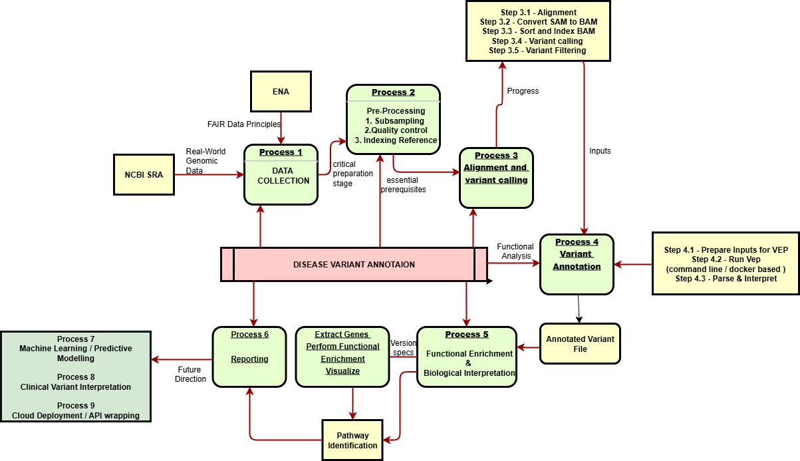

Rare Disease Variant Annotation Pipeline
Overview
This project implements a scalable, reproducible pipeline for annotating rare disease variants from whole genome sequencing (WGS) data. Using a combination of Bash scripts, Nextflow workflows, Python, and R, the pipeline automates steps from raw read download and quality control to alignment, variant calling, and functional annotation.

What exactly is a structural variant, and how can it empower your work?

A structural variant (SV) is a large-scale alteration in the genome that involves segments of DNA typically larger than 50 base pairs. These changes can include deletions, duplications, insertions, inversions, and translocations of genomic regions. Structural variants can disrupt gene function or regulation, leading to disease, including many rare genetic disorders.

Detecting structural variants empowers our rare disease variant annotation work by uncovering these significant genomic changes that might be missed by focusing solely on small-scale variants like single nucleotide polymorphisms (SNPs). Accurately identifying SVs helps provide a more complete genetic diagnosis, improves understanding of disease mechanisms, and supports personalized treatment strategies

What i did in this pipeline?

Project Structure
.
├── data/                  # Raw, subsampled reads and reference genome files
├── results/               # Outputs: alignments, variants, QC reports, annotations
├── scripts/               # Bash, Python preprocessing and summary scripts
├── visualization/         # Python and R scripts for plotting and enrichment analysis
├── workflow/              # Nextflow modules for QC, alignment, variant calling, annotation
├── main4.nf               # Main Nextflow pipeline workflow
├── run_fastqc.nf          # Nextflow QC workflow
├── nextflow.config        # Pipeline configuration file
└── README.md              # This documentation file

Stepwise Process
1. Data Acquisition
Raw paired-end WGS reads were downloaded from ENA FTP servers using the Bash script scripts/bash/download_thalassemia_fastq.sh.

The human GRCh38 reference genome was downloaded from Ensembl with scripts/bash/download_reference_genome.sh.

Due to repository size constraints, raw FASTQ files are not included in this repository. Instead, download links are referenced in the .gitattributes file for reproducibility.

2. Subsampling Raw Reads
To improve computational efficiency during pipeline development, subsampled FASTQ files were generated using seqtk:
'''bash
seqtk sample -s100 SRR32809192_1.fastq.gz 100000 > SRR32809192_1_sub.fastq
seqtk sample -s100 SRR32809192_2.fastq.gz 100000 > SRR32809192_2_sub.fastq
These subsampled files are stored in data/sub_fastq/ and used for rapid testing and quality control.

3. Reference Genome Indexing
The GRCh38 reference genome was indexed using tools to generate necessary files for alignment:

bwa index for .bwt, .pac, .sa

samtools faidx for .fai

Indexed files are stored in data/reference/.

4. Quality Control (QC)
FastQC was run on raw and subsampled FASTQ files using the Nextflow workflow run_fastqc.nf.

QC reports are saved under results/fastqc/.

5. Read Alignment
Reads were aligned to the indexed GRCh38 reference genome using bwa mem executed via the Nextflow workflow main4.nf and Python wrapper module (workflow/modules/alignment/bwa_align.py).

SAM files were converted to sorted BAM files using samtools.

Duplicate reads were marked to reduce PCR artifacts using a Python script wrapping Picard’s MarkDuplicates tool (workflow/modules/dedup/mark_duplicates.py).

6. Variant Calling
Variants were called from the processed BAM files using bcftools, integrated in the Nextflow module workflow/modules/variant_calling/bcftools_call.nf and its Python interface.

Generated VCF files were filtered to retain high-confidence rare disease candidate variants.

Variant calling outputs are stored in results/variants/.

7. Variant Annotation and Functional Analysis
The Variant Effect Predictor (VEP) was used to annotate variants with predicted impacts and gene context (workflow/modules/annotation/VEP.nf).

Annotation summaries and filtering were automated using Python scripts (scripts/variant_annotation_summary.py).

Functional enrichment, gene-pathway mapping, and visualization were performed with Python and R scripts located in the visualization/ directory.

Key plots and summary CSV files are saved in results/annotation/.

Usage
Clone the repository.

Download raw data and reference genome by running:

'''bash
bash scripts/bash/download_thalassemia_fastq.sh
bash scripts/bash/download_reference_genome.sh
Generate subsampled FASTQ files (optional for testing):

'''bash
Copy code
seqtk sample -s100 data/raw_reads/SRR32809192_1.fastq.gz 100000 > data/sub_fastq/SRR32809192_1_sub.fastq
seqtk sample -s100 data/raw_reads/SRR32809192_2.fastq.gz 100000 > data/sub_fastq/SRR32809192_2_sub.fastq
Run the full Nextflow pipeline:

'''bash
nextflow run main4.nf -c nextflow.config
Explore results in the results/ directory.

Use visualization scripts in visualization/ for further analysis.

Dependencies
Nextflow

BWA

Samtools

Picard

BCFtools

Seqtk

FastQC

Python 3 with relevant packages

R with plotting and analysis packages

Contact
For questions or suggestions, please contact Abishek A.

